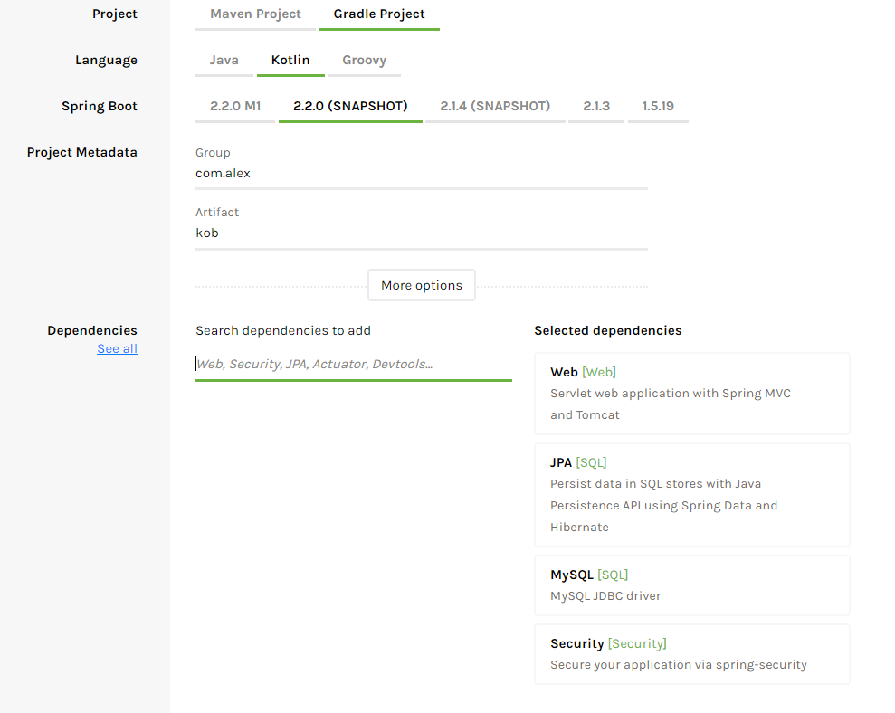
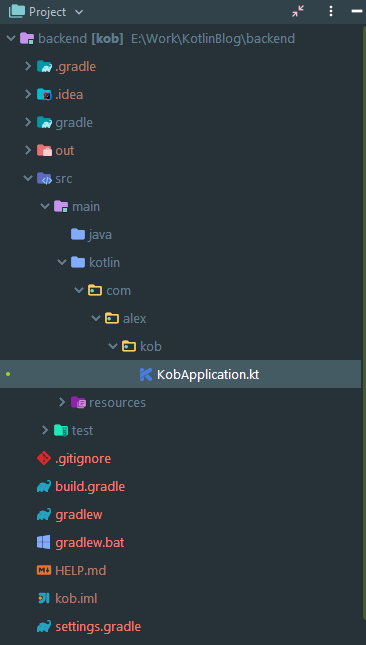

# 1. Configuring project

Let's get started. We will use the spring boot as an engine for our application because it's easy to configure, and many Java developers probably worked with it. As an alternative, you can use [Ktor](https://ktor.io/), but it seemed to me more difficult to start.

1. Go to the  [**Spring Initializr**](https://start.spring.io/) ****website and configure the project.
2. Choose Gradle project.
3. Choose Kotlin language.
4. Enter **kb** in Artifact field.
5. Add **Web**, **JPA**, **MySQL** and **Security** dependencies from the Dependencies section.
6. Click Generate Project to generate and download the project.



Let's unzip our project and open it in your favorit IDE. I strongly recommend connecting the [GIT version control system](https://git-scm.com/downloads) to project to simplify development. The directory structure of the project will look like this:



### Some more dependencies

Open `build.gradle` file and add two extra dependencies in `dependencies` block:

```text
	compile group: 'io.jsonwebtoken', name: 'jjwt', version: '0.9.1'
	compile group: 'com.fasterxml.jackson.datatype', name: 'jackson-datatype-jsr310', version: '2.9.8'
```

First for authentication \(Working with Json Web Tokens \(JWT\)\). Second for Date/Time support. 


#### Initial setup is complete. Applaud to yourself. Not so hard, right?

