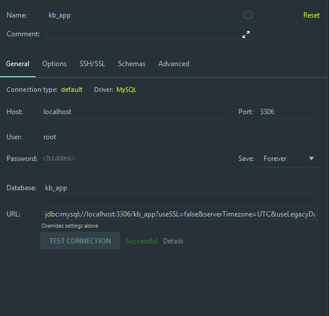

# 2. Database

Let's start developing our application. I chose [MySQL database](https://www.mysql.com/), as it's simplisity and completely covers our needs. But if desired, any database can be selected. 

In `src/main/resources/application.properties` file add simple configuration of our DB. Pay attention to the 5,6,7 line. Specify your own values.

```text
## Server Properties
server.port= 8080

## Spring DATASOURCE (DataSourceAutoConfiguration & DataSourceProperties)
spring.datasource.url= jdbc:mysql://localhost:3306/kb_app?useSSL=false&serverTimezone=UTC&useLegacyDatetimeCode=false
spring.datasource.username= root
spring.datasource.password= root

## Hibernate Properties

# The SQL dialect makes Hibernate generate better SQL for the chosen database
spring.jpa.properties.hibernate.dialect = org.hibernate.dialect.MySQL5InnoDBDialect
spring.jpa.hibernate.ddl-auto = update

## Hibernate Logging
logging.level.org.hibernate.SQL= DEBUG

# Initialize the datasource with available DDL and DML scripts
spring.datasource.initialization-mode=always

## Jackson Properties
spring.jackson.serialization.WRITE_DATES_AS_TIMESTAMPS= false
spring.jackson.time-zone= UTC

```

Create MySQL DB with name **kb\_app** \(or your own variant\). If you use Intellij Idea, you can connect it to your project. To do this, select the tab **database** in the right corner of the screen `Database > Data Source > MySQL` . Then add all DB parameters to access it. Do you remember scary line 5 in our config file? Copy it and add to the **URL** field. Test DB connection before complete and press OK.



### Time converters and UTC Timezone <a id="configuring-spring-boot-to-use-java-8-date-time-converters-and-utc-timezone"></a>

Open file with your `main` class and add the folowing code:

```text
package com.alex.kob

import org.springframework.boot.autoconfigure.SpringBootApplication
import org.springframework.boot.autoconfigure.domain.EntityScan
import org.springframework.boot.runApplication
import org.springframework.data.jpa.convert.threeten.Jsr310JpaConverters
import java.util.*
import javax.annotation.PostConstruct

@SpringBootApplication
@EntityScan(basePackageClasses = [KobApplication::class, Jsr310JpaConverters::class])
class KobApplication

@PostConstruct
internal fun init() {
	TimeZone.setDefault(TimeZone.getTimeZone("UTC"))
}

fun main(args: Array<String>) {
	runApplication<KobApplication>(*args)
}
```

And now all the Date/Time fields in the models automatically get converted to SQL types when we persist them in the database.

#### This is all about the initial database setup. Let's move on to model development.

